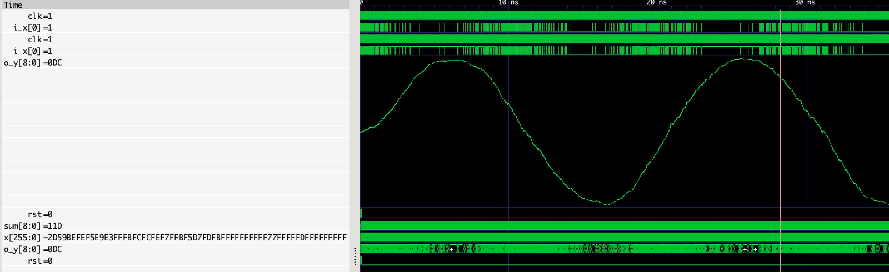

People like pictures. So here's a picture of what this Mean Value Filter does:

_Please note, this is not production-ready, and the code does not work for inputs that are greater in length than 1._

